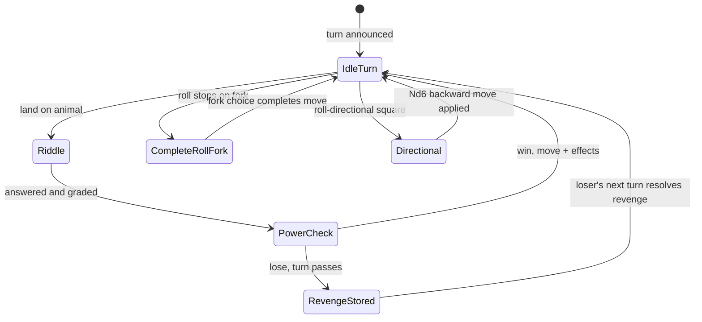

# Turn and pending flow

Reference for how a player turn works end-to-end, what `game.pending` means, and when `game.turn` changes.

## Encounter rules (Kalimba)

1. Player lands on an animal square → orchestrator sets `pending: riddle`.
2. LLM emits `ASK_RIDDLE` (four options + `correctOption`) → stored on pending.
3. Player answers → graded (strict match via [`riddle-answer.ts`](../src/orchestrator/riddle-answer.ts), or LLM judge as fallback).
4. Transition to `pending: powerCheck`.

**Dice:** correct answer gives +1 die; wrong gives +0 extra. Exact counts come from [`getPowerCheckRollSpec`](../src/orchestrator/power-check-dice.ts).

**Power check:** sum of Nd6 **`>`** animal power → win. Player advances by that roll on the board graph (Kalimba §2B/C — no separate movement die). Exception: `winJumpTo` or portal chain → [`afterEncounterRollPrompt`](../src/i18n/locales/en-US.ts) asks for a separate roll.

**Power check lose:** `pending` becomes `revenge`; turn passes to the next player via `advanceTurnMechanical`.

**Revenge:** 1d6 **`>=`** animal power → win. Fail → pending cleared, nothing happens.

Code: `const win = isRevenge ? roll >= power : roll > power` in [`riddle-power-check.ts`](../src/orchestrator/riddle-power-check.ts).

## `game.pending` kinds

| kind                   | key fields                                              | who acts                          | blocks turn advance          |
| ---------------------- | ------------------------------------------------------- | --------------------------------- | ---------------------------- |
| `riddle`               | playerId, position, power, riddleOptions, correctOption | current player answers trivia     | yes                          |
| `powerCheck`           | playerId, position, power, riddleCorrect                | current player rolls Nd6          | yes                          |
| `revenge`              | playerId, position, power                               | **loser** rolls 1d6               | yes (for loser's `playerId`) |
| `directional`          | playerId, position, dice                                | current player rolls Nd6 backward | yes                          |
| `completeRollMovement` | playerId, remainingSteps, direction                     | current player picks fork branch  | yes                          |

After power-check lose: `game.turn` is the next player; `pending` still holds encounter data for the **loser** until revenge resolves on a later turn.

Types: [`pending-types.ts`](../src/orchestrator/pending-types.ts). Blocking logic: [`TurnManager.hasPendingForCurrentTurn`](../src/orchestrator/turn-manager.ts).

## Turn advance

`game.turn` changes through one of two paths:

### Normal path

Orchestrator returns `turnAdvance: { kind: "callAdvanceTurn" }` → app runs `checkAndAdvanceTurn()` → [`TurnManager.advanceTurn()`](../src/orchestrator/turn-manager.ts).

`advanceTurn` is **guarded**: it returns null (no advance) when any of these hold:

- Phase is not `PLAYING`
- `game.winner` is set
- Square effect is being processed (`isProcessingSquareEffect`)
- Current player has pending decisions (`hasPendingDecisions`)
- Current player has pending state — riddle, powerCheck, revenge, directional, or completeRollMovement (`hasPendingForCurrentTurn`)

### Power-check lose path

[`RiddlePowerCheckHandler.handlePowerCheckLose`](../src/orchestrator/riddle-power-check.ts) → [`TurnManager.advanceTurnMechanical()`](../src/orchestrator/turn-manager.ts) (no guards; caller already cleared blockers) → orchestrator returns `turnAdvance: { kind: "alreadyAdvanced", nextPlayer }` → app announces the new player.

### Blocked

`advanceTurn()` returns null → turn stays with the current player.

```mermaid
flowchart TB
  result[OrchestratorGameplayResult]
  result --> none["turnAdvance: none"]
  result --> call["turnAdvance: callAdvanceTurn"]
  result --> already["turnAdvance: alreadyAdvanced"]

  call --> guard{TurnManager guards}
  guard -->|all clear| advance[game.turn = next player]
  guard -->|blocked| stay[turn stays]

  already --> announce[app announces next player]
  none --> noop[no turn change]
```

## One transcript pipeline

```mermaid
flowchart LR
  voice[Voice input] --> handle[handleTranscript]
  handle --> process[processTranscript]
  process --> validate[validateActions]
  validate --> execute[executeActions]
  execute --> enforce[enforceDecisionPoints]
  enforce --> compute[computeTurnAdvance]
  compute --> app[app: announce or advance]
  app --> policy[voice policy fallback]
```





## Key integration tests

- Power-check fail + turn advance: [`orchestrator.integration.test.ts:381`](../src/orchestrator/orchestrator.integration.test.ts)
- Power-check win + graph movement: [`orchestrator.integration.test.ts:436`](../src/orchestrator/orchestrator.integration.test.ts)
- Skip-turn landing after power-check win: [`orchestrator.integration.test.ts:603`](../src/orchestrator/orchestrator.integration.test.ts)
